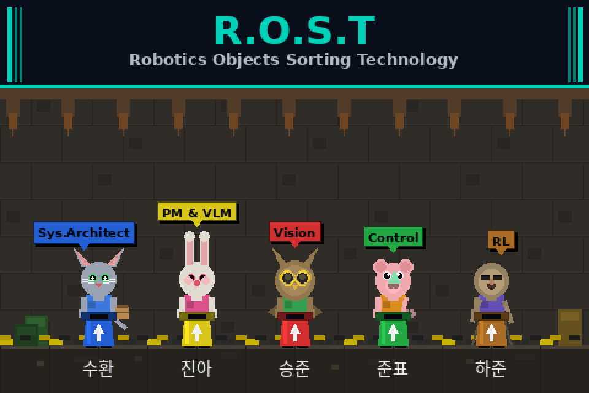

<p align="center">
  
</p>

# ROST_BOT
본 프로젝트는 ROS2 Humble이 설치되어 있는 환경을 기준으로 동작합니다.

## 🔄 시스템 워크플로우 (System Workflow)
본 시스템은 자동화된 초기화 세션과 지능형 판단 루프를 통해 분리수거를 수행합니다.

### 1. 초기화 단계 (Initialization)
Launch 실행: 단일 런치 파일을 통해 전체 시스템 기동.

H/W 활성화: 두산 로봇팔(Doosan Robot) 시스템 전원 인가 및 초기화.

노드 기동 (T+10s): 하드웨어 안정화 후 estimation_node와 control_node 자동 실행.

### 2. 인지 및 판단 단계 (Perception & Inference)
ROI 설정: 사용자가 지정한 관심 영역(Region of Interest) 내 물체 탐지.

VLM 추론:

탐지된 물체에 대해 **VLM(Vision Language Model)**이 객체의 종류(Class)를 판단.

물체의 픽셀 좌표(u, v) 및 Bounding Box 생성.

좌표 변환 (Coordinate Transformation):

카메라 픽셀 좌표 → 카메라 좌표계 → **로봇 베이스 좌표계(Robot Base Frame)**로 변환.

캘리브레이션 데이터를 기반으로 한 정밀 좌표 산출.

### 3. 제어 및 실행 단계 (Control & Execution)
데이터 전송 (Estimation → Control):

전송 데이터: Object ID, Target XYZ/RPY, Bin XYZ

분리수거 수행: 수신된 좌표를 바탕으로 두산 로봇팔이 Pick-and-Place 동작 수행.

상태 모니터링:

영역 내 쓰레기가 없으면 Task Completed 상태로 전환 및 대기(Idle).

새로운 물체 진입 시 자동으로 인지 루프 재시작.


## 실행 순서
### 사용자용

1. 워크 스페이스 폴더 생성(ros2_ws)
2. 폴더명 'src'로 클론
```bash
git clone https://github.com/silsilkun/ROST_BOT.git src
```
3. 두산 로봇팔, realsense 카메라 연결
4. TOF 센서 연결(TOF_BAUDRATE = 115200)
4. 빌드 및 실행
```bash
cd ~/ros2_ws
colcon build
source install/setup.bash
ros2 launch robot_system_bringup system.launch.py
```

### 개발자용 (협업 세팅 가이드)
*이 프로젝트는 협업용 패키지들만 GitHub로 관리하며, 개인 참고용(대용량) 패키지는 로컬에만 유지합니다.*

1. 본인 워크스페이스 내 src폴더의 git관련 파일들을(있다면) 패키지 폴더 안에 넣기(.git, .gitignore 등)
```bash
ls -a # 숨겨진 파일 확인, 있다면 개인 패키지 안으로 옮기기
```

2. src폴더 밑에서 git 저장소 생성
```bash
git init # "src"라는 이름의 로컬 repo(저장소)가 생성됨
```

3. git과 원격 저장소 연결
```bash
git remote add origin https://github.com/silsilkun/ROST_BOT.git
```

4. github의 main 폴더들 받기
```bash
git fetch origin # origin(원격 저장소)의 커밋/브랜치 정보를 가져옴
git switch -c main origin/main # 로컬에 main 브랜치 생성 및 원격에 연결 -> 원격 저장소의 폴더를 가져옴, main으로 브랜치 변경
```
```bash
# 로컬 main이 필요한 이유
git switch main
git pull origin main # 로컬 main의 최신화
# 최신화를 위해 각각의 브랜치에서 upstream 설정 해주는게 좋음. -u 옵션
``` 

5. *.gitignore에 개인 패키지 작성(doosan-robot2와 같은 패키지)*

6. 작업할 기능 브랜치로 이동
```bash
git branch -a #브랜치 이름 확인
git switch <브랜치 이름> #브랜치 생성 및 이동 시 -c 옵션추가,  "<>"꺽쇠괄호는 제거
```
7. 특정 브랜치 내에서는 특정 기능 패키지만 수정&Push
